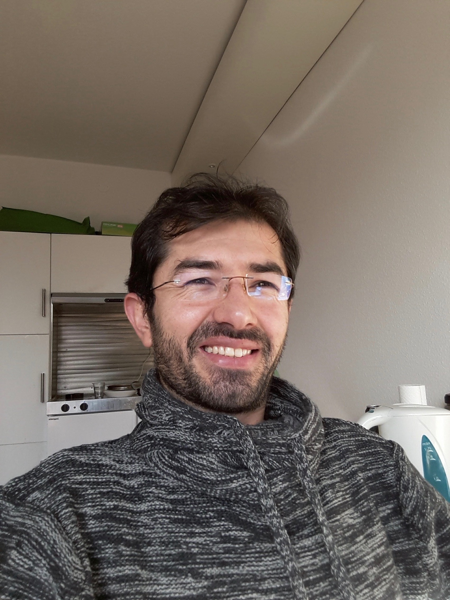

<!-- - - - - - - - - - - - - - - - -->

	

		

			Assistant Professor, Faryab University.
		

		

			I recieved my Master degree from <a href="www.tu-berlin.de">TU-Berlin</a> in 2018. Perior to that, behide working as assistant professor in Faryab University, I have spent four years as Senior IT Assistant in <a href="www.nrc.no"> NRC </a> northest Offices, from 2011 to 2015. I have also worked as Qos, Supervision and Operation Support Engineer at <a href="www.roshan.af"> Roshan Telecommunication </a> company from 2009 to 2011. Perior to that, I had recieved my bachelor degree in computer science from <a href="www.ku.af"> Kabul University </a>, 2009. 
		

		

			Beside the Education Faculty's counsil board membership, I am researching on Data Science and it's techniques to be studied in Afghan universities' computer science faculties and it will results to scale up my academic degree (from Pohanyar to Pohanmal). The research will be completed at most three years.  
			I have completed some semester-based projects and research with students from computer science department and I am looking again to some interesed students to work with me on some other useful projects. Usually the projects are based on problem-solving manner.
		

		

			I am looking to motivated and qualified students to work with me to build computer-based evaluation system of accreditation and qualification committee of Faryab University.
		

	

	

		 
		    
		  
		<!-- 
 -->
		<h6>  e-mail</h6>
		grLASTNAME@gmail.com
		  
		<h6>  Address</h6>
		Miamana city
	

<!-- - - - - - - - - - - - - - - - -->

	

		

			<h5>News</h5>
			<section markdown="1">
				this is section part (markdown). please put here something of news!
			</section>
		

	

